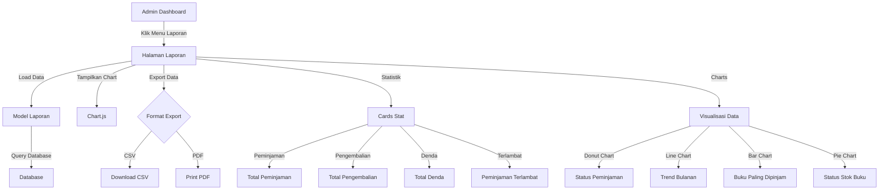
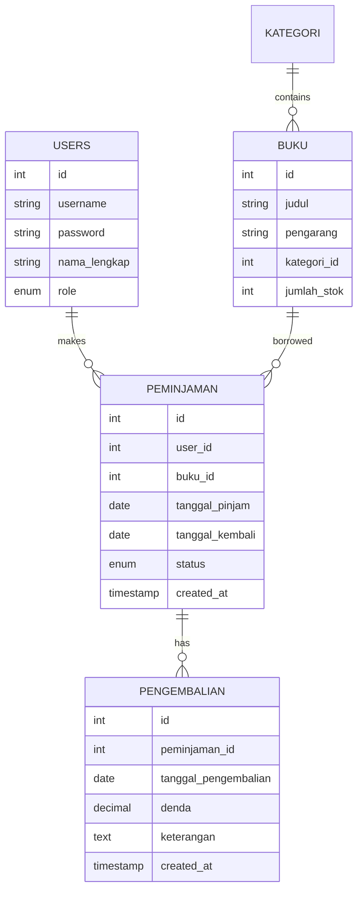

# Laporan Statistik - Sistem Perpustakaan Digital

Dokumentasi lengkap fitur laporan dan statistik dalam sistem perpustakaan.

## 📊 Diagram Alur Laporan



## 📈 Statistik yang Ditampilkan

### 1. **Kartu Statistic (Stat Cards)**
| Metrik | Deskripsi | Formula |
|--------|-----------|---------|
| Total Peminjaman | Jumlah seluruh peminjaman | COUNT(*) FROM peminjaman |
| Total Pengembalian | Jumlah buku yang dikembalikan | COUNT(*) FROM pengembalian |
| Total Denda | Total denda yang dikumpulkan | SUM(denda) FROM pengembalian |
| Peminjaman Terlambat | Buku yang belum dikembalikan tepat waktu | WHERE tanggal_kembali < TODAY |

### 2. **Detail Status Peminjaman**
```
├── Pengajuan     : Status peminjaman baru (menunggu approval)
├── Disetujui     : Admin sudah approve, siswa siap ambil
├── Dipinjam      : Siswa sudah ambil buku
├── Dikembalikan  : Buku sudah dikembalikan ke perpustakaan
└── Terlambat     : Buku melampaui batas tanggal kembali
```

## 📊 Jenis Chart yang Ditampilkan

### 1. **Doughnut Chart - Peminjaman per Status**
- Menampilkan distribusi peminjaman berdasarkan status
- Warna berbeda untuk setiap status
- Persentase dan jumlah terlihat jelas

**Contoh Data:**
```
Pengajuan      : 5 (10%)
Disetujui      : 8 (15%)
Dipinjam       : 25 (55%)
Dikembalikan   : 18 (40%)
```

### 2. **Line Chart - Peminjaman per Bulan**
- Trend peminjaman setiap bulan dalam tahun berjalan
- Menunjukkan performa peminjaman per bulan
- Membantu prediksi demand

**Contoh:**
```
Januari        : 5 peminjaman
Februari       : 8 peminjaman
Maret          : 12 peminjaman
...dst
```

### 3. **Bar Chart - Buku Paling Dipinjam**
- Menampilkan 5 buku dengan peminjaman tertinggi
- Membantu identifikasi buku populer
- Useful untuk penambahan stok

**Contoh:**
```
Laskar Pelangi      : 15 kali
Harry Potter 1      : 12 kali
Si Anak Badai       : 10 kali
Bumi                : 8 kali
Ayat-Ayat Cinta     : 7 kali
```

### 4. **Pie Chart - Status Stok Buku**
- Menampilkan kondisi stok buku
- Stok Ada, Stok Habis, Hampir Habis

**Contoh:**
```
Stok Ada       : 85 buku (85%)
Hampir Habis   : 10 buku (10%)
Stok Habis     : 5 buku (5%)
```

## 📋 Tabel Detail

### Tabel 1: Pengguna Paling Aktif
Menampilkan 5 siswa dengan peminjaman terbanyak

```
No  Nama              Total Peminjaman
1   Andi Pratama      15
2   Budi Santoso      12
3   Citra Dewi        10
4   Dina Kusuma       8
5   Eka Putri         7
```

### Tabel 2: Buku Paling Dipinjam
Menampilkan 5 buku dengan peminjaman terbanyak

```
No  Judul               Total Pinjam
1   Laskar Pelangi      15
2   Harry Potter        12
3   Si Anak Badai       10
4   Bumi                8
5   Ayat-Ayat Cinta     7
```

## 🔄 Database Schema untuk Laporan



## 💾 Export Functionality

### Export ke CSV
```
Format: Laporan_Peminjaman_[TANGGAL_AWAL]_[TANGGAL_AKHIR].csv

Isi:
- Headers: No, ID, Nama Peminjam, Judul Buku, dll
- Data dalam format tabel yang rapi
- Bisa dibuka di Excel/Google Sheets
```

### Export ke PDF
```
Format: Printable HTML
Fitur:
- Auto-trigger print dialog saat dibuka
- Format landscape untuk lebih rapi
- Data terformat dalam tabel
```

## 🔐 Akses Kontrol

- ✅ **Admin** : Bisa akses semua laporan dan export
- ❌ **Siswa** : Tidak punya akses menu laporan

## 📁 Struktur File

```
perpustakaan/
├── models/
│   └── Laporan.php              ← Model Laporan
├── controllers/
│   └── LaporanController.php    ← Controller Laporan
├── views/
│   └── laporan/
│       ├── index.php            ← Dashboard Laporan
│       └── lengkap.php          ← Laporan Lengkap
└── docs/
    └── diagrams/
        └── laporan_diagram.md   ← File ini
```

## 🛠️ URL Routes Laporan

```
GET  /index.php?page=laporan                   → Tampilan Utama Laporan
GET  /index.php?page=laporan&action=lengkap   → Laporan Lengkap
GET  /index.php?page=laporan&action=export    → Export Data
```

## 📝 Query-Query Penting

### Total Peminjaman per Status
```sql
SELECT 
    status,
    COUNT(*) as jumlah
FROM peminjaman
GROUP BY status
```

### Buku Paling Dipinjam
```sql
SELECT 
    b.judul,
    COUNT(p.id) as total_peminjaman
FROM buku b
LEFT JOIN peminjaman p ON b.id = p.buku_id
GROUP BY b.id
ORDER BY total_peminjaman DESC
LIMIT 10
```

### Peminjaman Terlambat
```sql
SELECT 
    p.*,
    DATEDIFF(CURDATE(), p.tanggal_kembali) as hari_terlambat
FROM peminjaman p
WHERE p.tanggal_kembali < CURDATE() 
AND p.status IN ('disetujui', 'dipinjam')
```

## 📊 Teknologi yang Digunakan

- **Chart.js** : Untuk visualisasi data
- **Chart Type:**
  - Doughnut Chart untuk distribusi
  - Line Chart untuk trend
  - Bar Chart untuk perbandingan
  - Pie Chart untuk proporsi
- **Export:** CSV (native), PDF (HTML print)
- **Database Query:** PDO dengan prepared statements

## 🎯 Features untuk Pengembangan Lanjutan

- [ ] Import laporan dari periode tertentu
- [ ] Filter laporan berdasarkan tanggal
- [ ] Tambah laporan pengguna per role
- [ ] Alert otomatis untuk buku yang hampir habis
- [ ] Prediksi demand berdasarkan trend
- [ ] Generate laporan otomatis setiap bulan
- [ ] Email notifikasi untuk denda yang belum dibayar
